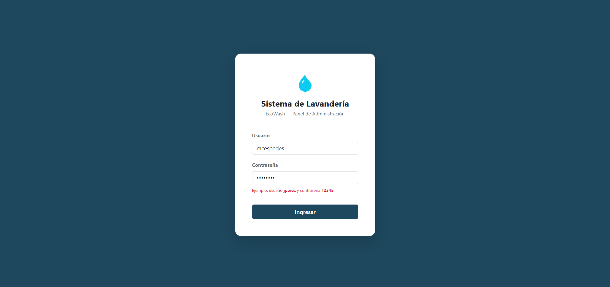
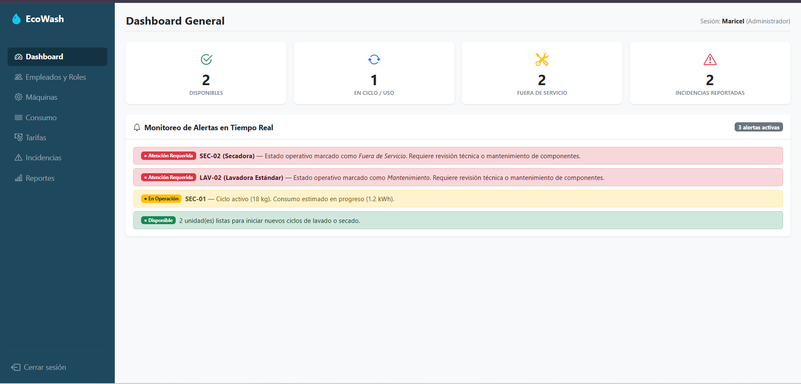
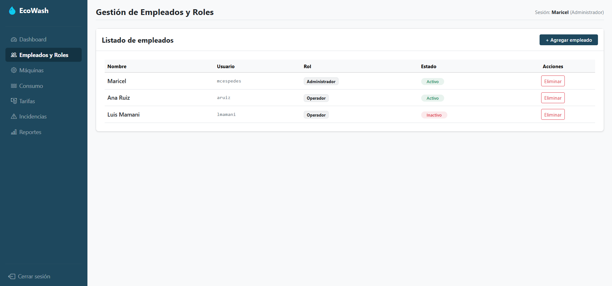
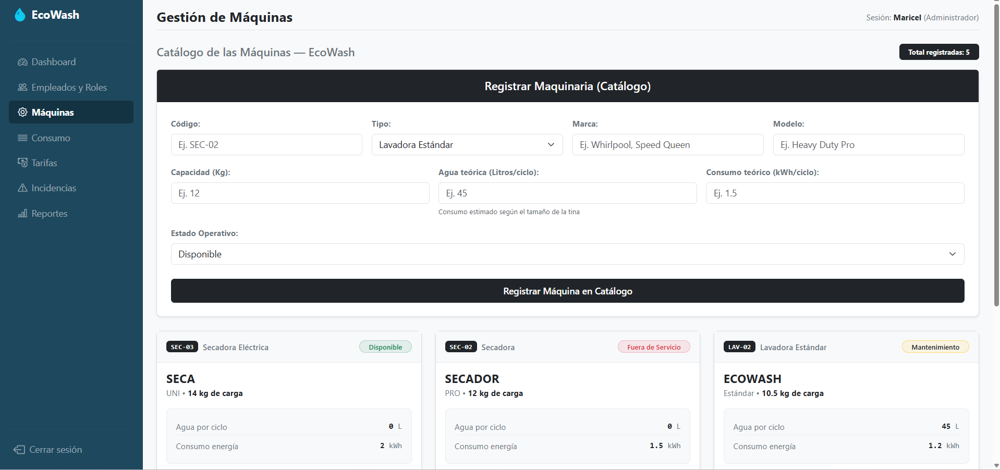
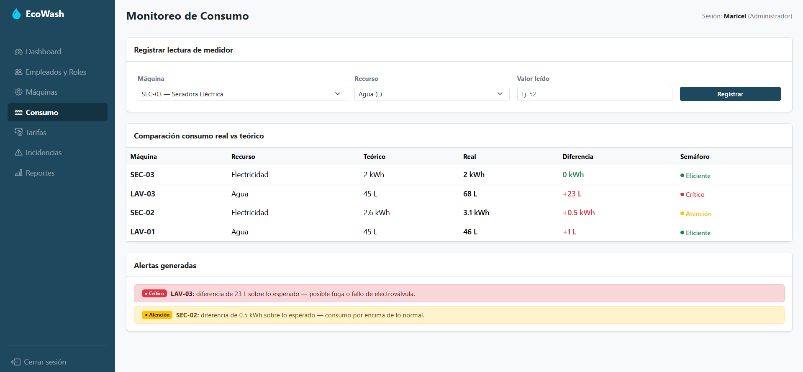
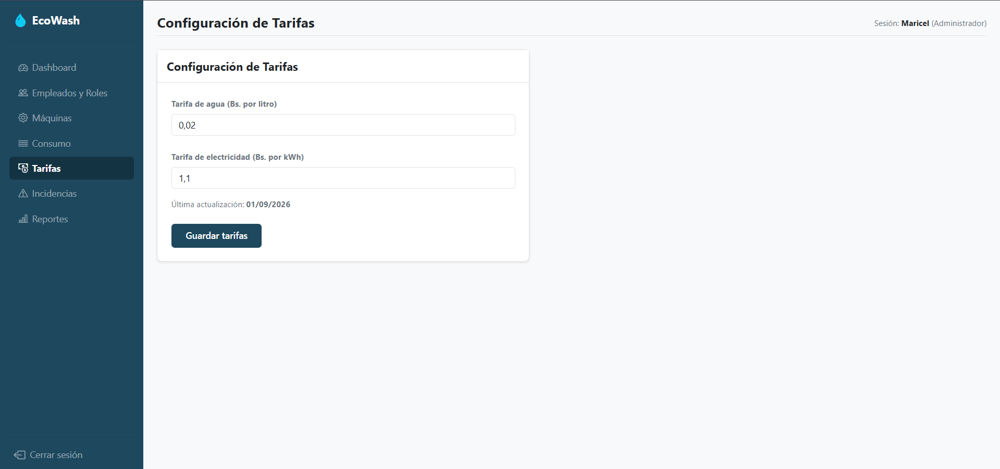
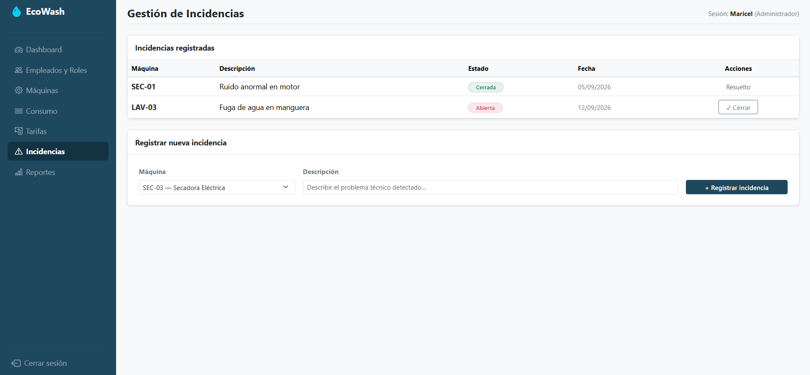
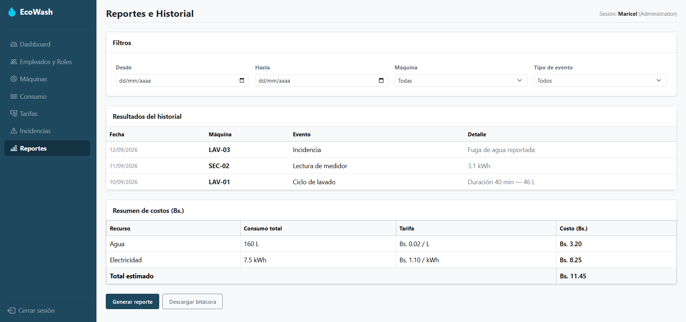

# EcoWash — Sistema de Gestión y Control de Recursos

Proyecto desarrollado para la materia **Programación Web II** (Facultad de Ingeniería, Universidad Privada Domingo Savio).

---

### Integrantes del Equipo
* Maricel Cespedes Rojas

**Docente:** Ing. Paul Mauricio Melgar Zabala  
**Fecha:** Septiembre de 2026  
**Ubicación:** Santa Cruz de la Sierra, Bolivia  

---

## Organización y vistas del sistema

